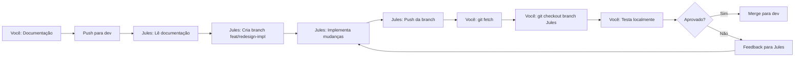

# 🤝 Guia de Colaboração com Jules.google

## 📤 Enviando Documentação para o Jules

### Opção 1: Via GitHub (Recomendado)

1. **Fazer merge manual na dev:**
   ```bash
   git checkout dev
   git merge feat/redesign-documentation
   git push origin dev
   ```

2. **Ou criar Pull Request:**
   - Acesse: https://github.com/patresio/sisinfo-v2
   - Crie PR de `feat/redesign-documentation` → `dev`
   - Faça merge

3. **Compartilhar com Jules:**
   - Envie o link do repositório
   - Ou envie os arquivos diretamente:
     - `docs/REDESIGN_VISUAL_GUIDE.md`
     - `docs/ADVANCED_IMPLEMENTATION.md`

### Opção 2: Arquivos Diretos

Envie para o Jules os 2 arquivos principais:
- `/home/patrese/projetos/prefeitura/sisinfo-v2/docs/REDESIGN_VISUAL_GUIDE.md`
- `/home/patrese/projetos/prefeitura/sisinfo-v2/docs/ADVANCED_IMPLEMENTATION.md`

---

## 📥 Baixando o Trabalho do Jules

### Quando o Jules Criar uma Branch

**1. Atualizar repositório local:**
```bash
cd /home/patrese/projetos/prefeitura/sisinfo-v2
git fetch origin
```

**2. Ver todas as branches (incluindo a do Jules):**
```bash
git branch -r
```

**3. Baixar a branch do Jules:**
```bash
# Se a branch do Jules for "feat/redesign-implementation"
git checkout -b feat/redesign-implementation origin/feat/redesign-implementation
```

**4. Testar as mudanças:**
```bash
# Instalar dependências (se houver novas)
npm install
pip install -r requirements.txt

# Executar migrações (se houver)
python manage.py migrate

# Iniciar servidor
npm run dev  # Terminal 1 (Tailwind)
python manage.py runserver  # Terminal 2 (Django)
```

**5. Verificar mudanças:**
```bash
# Ver arquivos modificados
git diff dev..feat/redesign-implementation

# Ver commits
git log dev..feat/redesign-implementation
```

---

## 🔄 Workflow Completo

### Fluxo de Trabalho Recomendado



### Comandos Resumidos

**Para você (após Jules terminar):**
```bash
# 1. Atualizar
git fetch origin

# 2. Listar branches remotas
git branch -r

# 3. Baixar branch do Jules (exemplo)
git checkout -b jules-redesign origin/jules-redesign

# 4. Testar
npm install
pip install -r requirements.txt
python manage.py migrate
npm run dev &
python manage.py runserver

# 5. Se aprovar, fazer merge
git checkout dev
git merge jules-redesign
git push origin dev

# 6. Deletar branch local (opcional)
git branch -d jules-redesign
```

---

## 🐳 Testando com Docker

Se o Jules implementar mudanças no Docker:

```bash
# 1. Baixar branch do Jules
git checkout -b jules-redesign origin/jules-redesign

# 2. Parar containers antigos
docker-compose down

# 3. Rebuild (se necessário)
docker-compose build

# 4. Iniciar
docker-compose up -d

# 5. Ver logs
docker-compose logs -f web

# 6. Acessar
# http://localhost:8000
```

---

## 📝 Checklist de Teste

Quando baixar o trabalho do Jules, verifique:

### Visual
- [ ] Login page redesenhada
- [ ] Menu retrátil funcionando
- [ ] Tema claro/escuro funcionando
- [ ] Responsivo em mobile
- [ ] Animações suaves

### Funcional
- [ ] Flowbite removido
- [ ] Alpine.js funcionando
- [ ] Gráficos renderizando
- [ ] WebSockets conectando (se implementado)
- [ ] Todos os formulários funcionando

### Performance
- [ ] Página carrega rápido
- [ ] Sem erros no console
- [ ] CSS/JS minificados (produção)

### Compatibilidade
- [ ] Chrome/Edge
- [ ] Firefox
- [ ] Safari (se possível)
- [ ] Mobile (Chrome/Safari)

---

## 🆘 Problemas Comuns

### "Branch não encontrada"
```bash
# Certifique-se de fazer fetch primeiro
git fetch origin
git branch -r  # Ver branches remotas
```

### "Conflitos ao fazer checkout"
```bash
# Salve mudanças locais primeiro
git stash
git checkout -b jules-branch origin/jules-branch
git stash pop  # Se quiser recuperar mudanças
```

### "Dependências faltando"
```bash
# Node.js
npm install

# Python
pip install -r requirements.txt

# Se usar Docker
docker-compose build --no-cache
```

### "Migrações pendentes"
```bash
python manage.py migrate

# Ou com Docker
docker-compose exec web python manage.py migrate
```

---

## 💡 Dicas

1. **Sempre faça backup antes de testar:**
   ```bash
   # Backup do banco
   python manage.py dumpdata > backup/antes_teste_jules.json
   ```

2. **Use branches separadas:**
   - Não teste direto na `dev`
   - Sempre crie uma branch local da branch do Jules

3. **Comunique-se:**
   - Se encontrar bugs, documente bem
   - Tire screenshots
   - Anote passos para reproduzir

4. **Teste incremental:**
   - Teste uma funcionalidade por vez
   - Não teste tudo de uma vez

---

## 📞 Comunicação com Jules

**Formato de Feedback Sugerido:**

```markdown
## Teste da Branch: feat/redesign-implementation

### ✅ Funcionando
- Login page está linda!
- Menu retrátil perfeito
- Tema escuro funcionando

### ⚠️ Problemas Encontrados
1. **Gráfico não renderiza**
   - Página: Dashboard
   - Erro no console: "ApexCharts is not defined"
   - Screenshot: [anexar]

2. **Menu não fecha no mobile**
   - Dispositivo: iPhone 12
   - Comportamento: Overlay não fecha ao clicar

### 💡 Sugestões
- Adicionar loading state nos gráficos
- Melhorar animação do sidebar

### 🎯 Próximos Passos
- Corrigir os 2 problemas acima
- Depois podemos fazer merge
```

---

**Última atualização:** 02/12/2025  
**Status:** Pronto para colaboração com Jules.google
